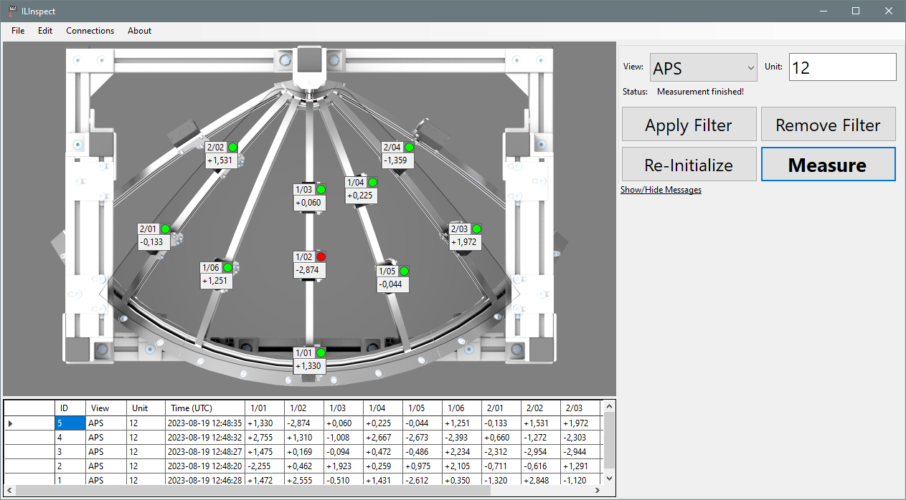
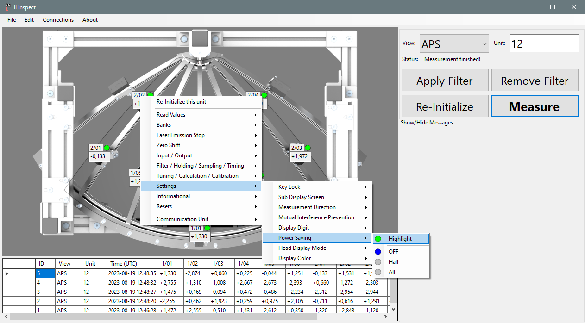
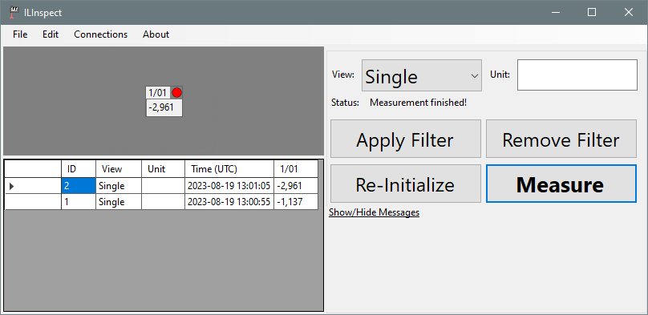
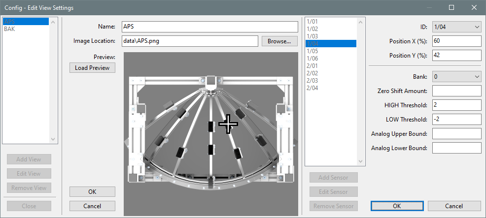

# ILInspect 

ILInspect is a simple measurement application program for Keyence [IL-Sensors](https://www.keyence.com/products/measure/laser-1d/il/) communicating through a [DL-EN1 communication unit](https://www.keyence.com/products/sensor/network-communication/dl/) written in .NET7.0 C# with Windows Forms, using a TCP/IP ethernet connection to communicate with the sensors.

It aims to provide a simple graphical user interface that allows the user to take measurements and document results in database, all with the single press of a button.

If you are looking to demo the application but don't have access to Keyence IL sensors and a DL-EN1 communication unit, please check out [ILSim](https://github.com/Jakob-Stadler/ILSim), a pure software simulation of the sensor communication for testing purposes.

ILInspect is designed with a two-pronged approach: Make the primary action as easy as possbile, while still providing powerful tools for system configuration. This approach allows a single proficient user to set up measurement regime, which can be performed by other less proficient users without extensive training and instructions.

## Building

Download / Clone this repository and open the .sln file in Visual Studio. It should automatically download the required NuGet packages ( [Microsoft.EntityFrameworkCore.Sqlite](https://www.nuget.org/packages/Microsoft.EntityFrameworkCore.Sqlite)  ) required to build the project.

You can then compile the project in Visual Studio by clicking on Build and then Build Solution.

## Installation

Since the project is very simple, all required files are included in the build directory. You can copy this directory anywhere you want. Make sure end users have Write access to the database file which is located in the `data` folder by default.

## Usage

Starting up, ILInspect will load the default configuration from `data/config.json`, set up the sensor connections, initialize them according to the configuration and be ready to go.

Clicking the highlighted Measure button will poll the sensors for their current measurement values, display them with a color-coded Go/NoGo indicator on the screen, and document them in a SQLite database.

A customizable Unit descriptor can be used add additional information to the stored measurements in the database, which can be very useful to keep track of distinct inventory or lot numbers. Pressing "Apply Filter" will filter the displayed database to exactly that Unit descriptor, allowing you to keep track of changes to the measurements over time.

## Configuration

### Sensor Configuration

ILInspect does allow you to remotely read and change the sensor settings of your Keyence IL Sensors without needing to press the buttons on the sensor amplification unit.

Just click on the sensor name in main view to display a context menu of all available options. Please refer to the [IL user manual](https://www.keyence.com/download/download/confirmation/?dlAssetId=AS_49018&dlSeriesId=WS_SR48219&dlModelId=&dlLangId=&dlLangType=en-GB) (Download requires free account registration) for a detailed explanation on what each option does. Alternatively, you can even configure non-visible sensors by going through the Connections menu in the top menu bar.

This remote access function makes ILInspect still useful as a configuration tool, even if you use another custom-built software package for the measurement routine itself.

### Application Configuration

Application configuration can be split in three parts: the connection to the sensors, the views which are displayed on the main window, and the database connection. All of them are stored in `.json` files and can be saved/loaded from the File menu and changed in the Edit menu in the top menu bar.

This allows the use of ILInspect in very different scenarios, like this very simple one sensor example:

The connection settings define how many sensors are connected to the network and where they can be found. They also contain additional safety settings that allow automatically turning on the laser emission during the measurement and shut them off after.

The view settings contain the different views that layout where sensors are located on the background image and which quick settings apply to them. This allows ILInspect to be used for multiple similar part geometries with different tolerances.

The database settings are the most simple ones. They define the location of the database file where all the measurements get written to. Since SQLite is used for the database connection, the pseudo file location `:memory:` can be set to use a temporary database which doesn't get saved to disk.

For advanced users, it can be faster to edit the JSON configuration files directly. For these users, a `schema.json` file is included which provides auto-complete and validation of configuration files in compatible file editors like Visual Studio or Visual Studio Code.
